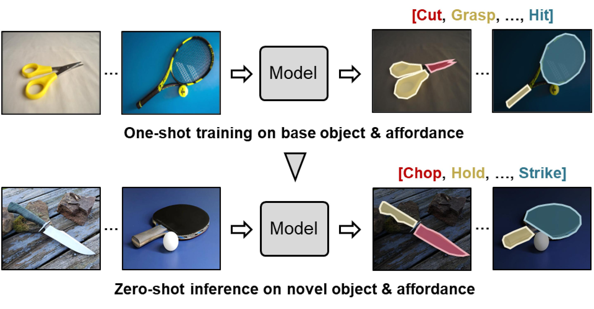

# One-Shot Open Affordance Learning with Foundation Models

[](https://openaccess.thecvf.com/content/CVPR2024/papers/Li_One-Shot_Open_Affordance_Learning_with_Foundation_Models_CVPR_2024_paper.pdf)
[](https://reagan1311.github.io/ooal/)
[](https://www.youtube.com/watch?v=PqBYFl3gmyY) 

## Abstract

We introduce One-shot Open Affordance Learning (OOAL), where a model is trained with just one example per base object category, but is expected to identify novel objects and affordances. While vision-language models excel at recognizing novel objects and scenes, they often struggle to understand finer levels of granularity such as affordances. To handle this issue, we conduct a comprehensive analysis of existing foundation models, to explore their inherent understanding of affordances and assess the potential for data-limited affordance learning. We then propose a vision-language framework with simple and effective designs that boost the alignment between visual features and affordance text embeddings. Experiments on two affordance segmentation benchmarks show that the proposed method outperforms state-of-the-art models with less than 1% of the full training data, and exhibits reasonable generalization capability on unseen objects and affordances.

<p align="center">
 
</p>

## Usage

### 1. Requirements

Code is tested under Pytorch 1.12.1, python 3.7, and CUDA 11.3

```
pip install -r requirements.txt
```

### 2. Dataset

Download the AGD20K dataset
from [ [Google Drive](https://drive.google.com/file/d/1OEz25-u1uqKfeuyCqy7hmiOv7lIWfigk/view?usp=sharing) | [Baidu Pan](https://pan.baidu.com/s/1IRfho7xDAT0oJi5_mvP1sg) (g23n) ]
.

Download the one-shot data [Google Drive](https://drive.google.com/file/d/1YSg31h7b66E-6evnmFAOfTVS40BcUTtW/view?usp=sharing) (you can annotate your own one-shot data in the same format).


Put the data in the `dataset` folder with following structure.
```
dataset
├── one-shot-seen
├── one-shot-unseen
├── Seen
└── Unseen  
```

### 3. Train and Test

Run following commands to start training or testing:
```
python train.py
python test.py --model_file <PATH_TO_MODEL>
```
Our pretrained model can be downloaded from [Google Drive](https://drive.google.com/file/d/1pJAiwPsnjn3QhmUj24XMDXL9bFsyJedZ/view?usp=sharing).

## Limitations
1. Text prompt learning improves the performance on unseen objects but diminishes the framework’s ability to handle unseen affordances. For open-vocabulary affordance usage, we suggest either removing text prompts or combing learnable prompts with manually designed prompts.  
2. The performance is notably influenced by the selection of the one-shot example. Instances with heavy occlusion or inferior
lighting conditions can impact the learning performance.

## Citation

```
@inproceedings{li:ooal:2024,
  title = {One-Shot Open Affordance Learning with Foundation Models},
  author = {Li, Gen and Sun, Deqing and Sevilla-Lara, Laura and Jampani, Varun},
  booktitle={Proceedings of the IEEE/CVF Conference on Computer Vision and Pattern Recognition},
  year={2024}
}
```

## Anckowledgement

Some code is borrowed from [CoOp](https://github.com/KaiyangZhou/CoOp) and [ZegCLIP](https://github.com/ZiqinZhou66/ZegCLIP). Thanks for their great work!
